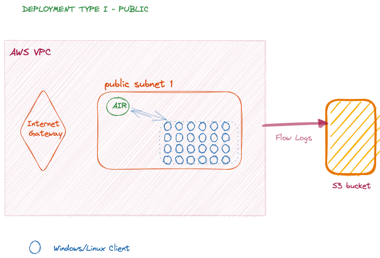

# BINALYZE AIR LAB Environment



This is a minimal setup to showcase product features. The environment and terraform code is not suitable for the production use.

## How to set up the lab environment?

Make sure that you can terraform from your local machine. It needs AWS access token installed locally.

Run the commands below to set up your environment.
```
$terraform init
$terraform apply -var-file public.tfvars
```
The plan adds the local machine's public ip to a white list to access the server.The commands will output the public ip of the server. You can login with the credentials:
```
air@binalyze.com:LabUser2023
```
If you need to connect to the windows clients, you can use the .pem file created at the working directory of the TF plan. The same file can used to SSH into the server.

The VPC flow logs are also enabled and can be found on the output S3 bucket.

There is a helper service installed with the Binalyze solution stack. You can access this service via the address below. The root directory if this server provides access to the console server logs. This address can be accessible by local clients, which can be achieved via RDP to the Windows machines.
```
https://<Local ip address of air console>:9999/share
```
You can find the self-signed certificate, Windows installation file, Linux installation file and a deployment token.


Feel free to play with the public.tfvars file. You can chnage the client numbers, OS types, machine sizes, etc.
## TODO
- WIP - Linux clients will be added soon.
